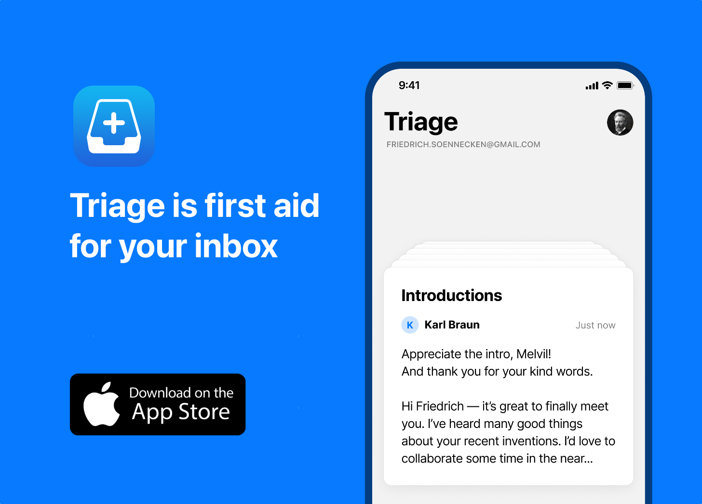

# SwiftIMAP

A modern, pure-Swift IMAP client library with async/await support. SwiftIMAP provides a clean, type-safe API for interacting with IMAP email servers without any C dependencies.

## Features

- **Pure Swift**: No C or Objective-C dependencies
- **Modern Async/Await**: Built with Swift Concurrency from the ground up
- **Type-Safe**: Strongly typed commands and responses
- **Secure by Default**: TLS 1.2+ with certificate validation
- **Memory Efficient**: Streaming support for large messages
- **Custom Labels**: IMAP keywords via raw flag support
- **Well-Tested**: Comprehensive unit test coverage

## Requirements

- Swift 5.10+
- macOS 13+, iOS 16+, tvOS 16+, watchOS 9+

## Installation

### Swift Package Manager

Add SwiftIMAP to your `Package.swift`:

```swift
dependencies: [
    .package(url: "https://github.com/HokuNZ/SwiftIMAP.git", from: "2.0.0")
]
```

## Quick Start

```swift
import SwiftIMAP

// Configure the client
let config = IMAPConfiguration(
    hostname: "imap.example.com",
    port: 993,
    authMethod: .login(username: "user@example.com", password: "password")
)

// Create client
let client = IMAPClient(configuration: config)

// Connect and authenticate
try await client.connect()

// List mailboxes
let mailboxes = try await client.listMailboxes()
for mailbox in mailboxes {
    print("Mailbox: \(mailbox.name)")
}

// Select a mailbox
let status = try await client.selectMailbox("INBOX")
print("Messages in INBOX: \(status.messages)")

// Search for messages
let messageUIDs = try await client.listMessageUIDs(in: "INBOX")

// Fetch a message
if let firstUID = messageUIDs.first {
    if let message = try await client.fetchMessage(uid: firstUID, in: "INBOX") {
        print("Subject: \(message.envelope?.subject ?? "No subject")")
    }
}

// Disconnect
await client.disconnect()
```

> An `IMAPClient` wraps a single connection with one selected mailbox. Its
> mailbox-scoped operations are not safe to run concurrently on one instance —
> issue them serially, or use one client per concurrent context.

A complete runnable version of this flow is in
[`Examples/BasicUsage/BasicUsage.swift`](Examples/BasicUsage/BasicUsage.swift)
(`swift run BasicUsageExample`).

## Command-Line Tool

SwiftIMAP includes `swift-imap-tester` for exercising connections against a real
server. It has two subcommands, `connect` (one-shot) and `interactive`.

### Building the CLI

```bash
swift build --product swift-imap-tester
```

### One-shot commands

`connect` runs a single command and exits. `--command` accepts `list` (default),
`select`, `search`, or `fetch`:

```bash
# List mailboxes
.build/debug/swift-imap-tester connect \
  --host imap.gmail.com --username your@email.com --password yourpassword \
  --command list

# Fetch a specific message
.build/debug/swift-imap-tester connect \
  --host imap.gmail.com --username your@email.com --password yourpassword \
  --command fetch --mailbox INBOX --uid 12345
```

Connection flags (both subcommands): `--host`, `--username`, `--password`,
`--port` (default 993), `--starttls`, `--no-tls`, `--verbose`.

### Interactive mode

```bash
.build/debug/swift-imap-tester interactive \
  --host imap.gmail.com --username your@email.com --password yourpassword
```

Interactive commands (type `help` for the full list):

- `list [pattern]`, `select <mailbox>`, `status [mailbox]`, `close`
- `messages`, `fetch <uid>`, `capability`
- `search [from <email> | subject <text> | text <text> | unread | flagged | since <date>]`
- `read <uid>`, `unread <uid>`, `flag <uid>`, `unflag <uid>`
- `copy <uid> <mailbox>`, `move <uid> <mailbox>`, `delete <uid>`, `expunge`
- `help`, `quit`

## API Documentation

### Configuration

```swift
let config = IMAPConfiguration(
    hostname: "imap.example.com",
    port: 993,  // Default IMAP SSL/TLS port
    tlsMode: .requireTLS,  // .requireTLS, .startTLS, or .disabled
    authMethod: .login(username: "user", password: "pass"),
    connectionTimeout: 30,  // seconds
    commandTimeout: 60,     // seconds
    logLevel: .info        // .none, .error, .warning, .info, .debug, .trace
)
```

### Authentication Methods

```swift
// Username/Password
.login(username: "user", password: "password")

// PLAIN mechanism
.plain(username: "user", password: "password")

// OAuth 2.0
.oauth2(username: "user", accessToken: "token")

// External (client certificate)
.external

// Custom SASL flow
.sasl(
    mechanism: "PLAIN",
    initialResponse: "base64-encoded",
    responseHandler: { challenge in
        // Return Base64-encoded response or "" for an empty response
        return "next-base64-response"
    }
)
```

### Working with Mailboxes

```swift
// List all mailboxes
let mailboxes = try await client.listMailboxes()

// List with pattern
let inboxSubfolders = try await client.listMailboxes(pattern: "INBOX.*")

// List only subscribed mailboxes
let subscribed = try await client.listSubscribedMailboxes()

// Get mailbox status without selecting
let status = try await client.mailboxStatus("Sent")

// Create / rename / delete, and manage subscriptions
try await client.createMailbox("Projects/2026")
try await client.renameMailbox(from: "Projects/2026", to: "Archive/2026")
try await client.subscribeMailbox("Archive/2026")
try await client.unsubscribeMailbox("Archive/2026")
try await client.deleteMailbox("Archive/2026")
```

### Message Operations

```swift
// Search messages
let allMessageUIDs = try await client.listMessageUIDs(
    in: "INBOX",
    searchCriteria: .all
)

let unreadUIDs = try await client.listMessageUIDs(
    in: "INBOX",
    searchCriteria: .unseen
)

let fromAlice = try await client.listMessageUIDs(
    in: "INBOX",
    searchCriteria: .from("alice@example.com")
)

// Fetch message summary
let summary = try await client.fetchMessage(
    uid: 12345,
    in: "INBOX",
    items: [.uid, .flags, .envelope, .bodyStructure]
)

// Fetch full message body
let bodyData = try await client.fetchMessageBody(
    uid: 12345,
    in: "INBOX",
    peek: true  // Don't mark as read
)

// Add/remove custom label (IMAP keyword)
try await client.storeFlags(uid: 12345, in: "INBOX", flags: ["ProjectA"], action: .add)
let labeled = try await client.searchMessages(in: "INBOX", criteria: .keyword("ProjectA"))

// Labels map to IMAP keywords (Gmail's X-GM-LABELS extension is not implemented)

// Mark read / unread
try await client.markAsRead(uid: 12345, in: "INBOX")

// Move, copy, delete
try await client.moveMessage(uid: 12345, from: "INBOX", to: "Archive")
try await client.copyMessages(uids: [1, 2, 3], from: "INBOX", to: "Backup")
try await client.deleteMessages(uids: [12345], in: "INBOX")   // STORE \Deleted, then UID EXPUNGE

// Append a message (e.g. save a draft)
try await client.appendMessage(rfc822Data, to: "Drafts", flags: [.draft])
```

**Guarding writes against a stale mailbox view.** Pass `expectedUIDValidity:` to
any write (`storeFlags`, `moveMessage(s)`, `copyMessage(s)`, `expunge(uids:)`,
`deleteMessage(s)`) and it's refused with `IMAPError.uidValidityChanged`, before
any command is sent, if the mailbox was recreated since you read those UIDs:

```swift
let status = try await client.selectMailbox("INBOX")
let uids = try await client.listMessageUIDs(in: "INBOX", searchCriteria: .unseen)
try await client.moveMessages(uids: uids, from: "INBOX", to: "Archive",
                              expectedUIDValidity: status.uidValidity)
```

> Targeted `deleteMessage(s)` / `expunge(uids:)` require `UIDPLUS` (they use
> `UID EXPUNGE`) and throw `unsupportedCapability("UIDPLUS")` otherwise. Without
> the `MOVE` extension, `moveMessage(s)` falls back to copy-then-mark-`\Deleted`,
> leaving the source until expunged.

### Threading

`Message-ID`, `In-Reply-To`, and `References` are exposed as `MessageId` values
rather than raw strings. `MessageId` canonicalises to the bare form on parse, so
identifiers compare equal regardless of how a server framed them (with or without
angle brackets) — threading comparisons need no bracket handling:

```swift
// Fetch the References header alongside the envelope
let summary = try await client.fetchMessage(
    uid: 12345, in: "INBOX",
    items: [.envelope, .bodyHeaderFields(fields: ["References"], peek: true)]
)

if let parent = summary?.envelope?.inReplyTo,
   summary?.references.contains(parent) == true {
    // this message replies to a known ancestor in its own thread
}

let id = summary?.envelope?.messageId
id?.value       // "abc@host"   — bare canonical identity
id?.bracketed   // "<abc@host>" — ready to write into an outgoing header
```

### MIME content and attachments

Parse a fetched body into its MIME parts — text, HTML, and attachments:

```swift
guard let data = try await client.fetchMessageBody(uid: 12345, in: "INBOX"),
      let mime = try MessageSummary.parseMIMEContent(from: data) else { return }

let text = mime.plainTextContent
let html = mime.htmlContent
for attachment in mime.attachments {
    print("\(attachment.filename ?? "unnamed"): \(attachment.decodedData?.count ?? 0) bytes")
}
```

`ParsedMIMEMessage` and `MIMEPart` are `Sendable` value types (parts hold decoded
content), so parsed results can cross actor and task boundaries.

### Parsing raw messages

For consumers holding raw RFC 822 bytes rather than a live `FETCH` — `.eml`
files, Maildir, webhook payloads, test fixtures — build the typed model directly.
Header parsing is independent of the MIME body (so an unparseable body won't lose
the envelope) and tolerates real-world bytes (non-UTF-8 content, a leading mbox
`From ` line):

```swift
// Whole message → MessageSummary (envelope + references populated)
let summary = try MessageSummary.parse(rfc822: emlData)

// Just a header dictionary → typed Envelope
let envelope = Envelope(parsingHeaders: ["From": "a@x.com", "Subject": "Hi"])
```

> A parsed summary is read-only metadata: its `uid` is a placeholder (`0`), so
> don't pass it back into UID-based operations.

See [`Examples/OfflineParsing/OfflineParsing.swift`](Examples/OfflineParsing/OfflineParsing.swift)
for a runnable, server-free example (`swift run OfflineParsingExample`).

### Error Handling

All operations throw `IMAPError`. When the server rejects a command, `commandFailed`
carries a structured `IMAPServerResponse` so you can log a faithful server response
line and distinguish causes. SwiftIMAP never puts your command arguments, credentials,
or message bodies into error output. Two caveats on server-supplied text: a
`commandFailed`/`connectionClosed` response `line` includes the server's own text,
which some servers echo user-specific details into (e.g. a mailbox name); and a
`parsingError` embeds a truncated slice of the offending server input for diagnostics,
which can include message content. Treat both as potentially sensitive before exporting
to third parties.

```swift
do {
    try await client.moveMessage(uid: 12345, from: "INBOX", to: "Archive")
} catch let error as IMAPError {
    switch error {
    case .commandFailed(let response):
        // response.status  -> .no / .bad
        // response.code    -> e.g. .tryCreate, .other("OVERQUOTA", nil)
        // response.line    -> "NO [TRYCREATE] Mailbox does not exist"
        //                     (server text — may echo user details like a mailbox name)
        log.error("\(response.commandName) failed: \(response.line)")
        if response.isMailboxNotFound { /* destination renamed or removed */ }
        if response.isOverQuota { /* account over quota */ }
    case .connectionClosed(let response):
        // A server BYE, e.g. "BYE [ALERT] Too many connections"
        log.error("Connection closed: \(response?.line ?? "unexpected")")
    case .timeout(let command):
        log.error("Timed out: \(command ?? "connection")")
    case .connectionFailed(_, let underlying):
        // The typed transport cause (NIO/SSL error) is preserved for inspection
        log.error("Connect failed: \(underlying.map(String.init(describing:)) ?? "unknown")")
    default:
        log.error("\(error.localizedDescription)")
    }
}
```

The `default:` arm above is deliberate — see [Versions](#versions) for why library
enums need one.

## Testing

Run the test suite:

```bash
swift test
```

Run tests with verbose output:

```bash
swift test --enable-code-coverage --verbose
```

## Architecture

SwiftIMAP is built with a layered architecture:

1. **Network Layer** (SwiftNIO + NIOSSL): Handles TCP connections and TLS
2. **Protocol Layer** (Parser/Encoder): Implements IMAP protocol parsing and encoding
3. **API Layer** (IMAPClient): Provides high-level async/await APIs

## Security

- TLS 1.2+ is required by default
- Certificate validation enabled
- Sensitive data (passwords) never logged
- Support for certificate pinning via custom TLSConfiguration

## Versions

SwiftIMAP follows [semantic versioning](https://semver.org). Breaking changes to
the public API land only in major releases. The [CHANGELOG](CHANGELOG.md) records
the per-release detail.

### Migration

Upgrading across a major? The [1.x → 2.0 migration guide](docs/migration-v1-to-v2.md)
lists every change that needs a code update, with the replacement for each, and
the [CHANGELOG](CHANGELOG.md) carries the full per-change history.

### API stability

**Enums may grow in minor releases.** Public enums — `IMAPError`,
`IMAPResponse.ResponseCode`, `IMAPCommand.SearchCriteria`, and others — may gain
new cases in a minor release. When you switch over one, always include a
`default:` arm so a new case doesn't break your build:

```swift
switch error {
case .commandFailed(let response): ...
case .connectionClosed(let response): ...
default: log.error("\(error.localizedDescription)")   // tolerates future cases
}
```

(Swift source packages can't use `@unknown default`, so a plain `default` is the
tool here.)

## Contributing

Contributions are welcome! Please feel free to submit a Pull Request.

## Used By

<a href="https://triage.cc"></a>

## Disclosure

This repository is LLM-generated code, and we have done our best to be accurate, but 🤷‍♂️ it works for us.

## License

SwiftIMAP is released under the MIT license. See [`LICENSE`](LICENSE) for details,
and [`THIRD-PARTY-LICENSES.md`](THIRD-PARTY-LICENSES.md) for third-party dependency acknowledgements.
